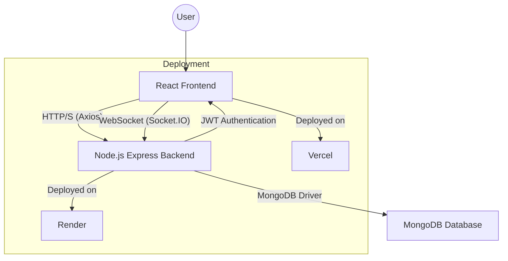

# ShelfEx - Job Application Tracking System
## Documentation

### 1. Problem Understanding

#### 1.1 Project Overview
ShelfEx is a comprehensive job application tracking system designed to help users manage their job search process effectively. The system allows users to track their job applications, manage application statuses, and receive real-time notifications about their applications.

#### 1.2 Key Problems Addressed
1. **Job Application Organization**: Users often struggle to keep track of multiple job applications across different companies and roles.
2. **Status Tracking**: Difficulty in maintaining up-to-date information about application statuses (applied, interviewing, offered, rejected).
3. **Real-time Updates**: Lack of immediate notifications for important changes in application status.
4. **User Management**: Need for both regular users and administrative oversight.
5. **Data Security**: Ensuring secure storage and access to sensitive job application data.

### 2. Architecture & Tech Stack

#### 2.1 Frontend Architecture
- **Framework**: React with TypeScript
- **UI Library**: Material-UI (MUI)
- **State Management**: React Context API
- **Routing**: React Router v6
- **Real-time Communication**: Socket.IO Client
- **HTTP Client**: Axios
- **Form Handling**: Native React forms with controlled components

#### 2.2 Backend Architecture
- **Runtime**: Node.js with TypeScript
- **Framework**: Express.js
- **Database**: MongoDB with Mongoose ODM
- **Authentication**: JWT (JSON Web Tokens)
- **Real-time Communication**: Socket.IO
- **API Documentation**: Express routes with TypeScript types

#### 2.3 System Architecture

### 3. Development Approach

#### 3.1 Development Methodology
- **Agile Development**: Iterative development with continuous feedback
- **Feature-First Approach**: Building core features first, then adding enhancements
- **Type-First Development**: Using TypeScript for better type safety and developer experience

#### 3.2 Key Features Implementation
1. **Authentication System**
   - JWT-based authentication
   - Role-based access control (Admin/User)
   - Secure password hashing
   - Protected routes

2. **Job Application Management**
   - CRUD operations for job applications (Create, Read, Update, Delete)
   - Status tracking
   - Date-based sorting
   - Search and filter capabilities

3. **Real-time Notifications**
   - Socket.IO integration for live updates
   - Toast notifications on frontend
   - Admin notifications for system-wide events
   - Job status updates pushed to users

4. **User Management**
   - User profile management
   - Password update functionality
   - Admin panel for user role management and deletion

### 4. Challenges Faced & Solutions

#### 4.1 Database Migration
**Challenge**: Initial implementation used MySQL, but later migrated to MongoDB for better scalability and flexibility.
**Solution**: 
- Created Mongoose schemas for existing data models.
- Updated API endpoints to use Mongoose methods and MongoDB queries.
- Ensured proper TypeScript types for MongoDB documents and operations.

#### 4.2 Real-time Updates
**Challenge**: Implementing reliable real-time notifications across different user roles and ensuring persistent connections.
**Solution**:
- Integrated Socket.IO for bidirectional communication.
- Implemented Socket.IO rooms for user-specific notifications.
- Developed a `NotificationContext` on the frontend for centralized toast notification management.
- Added reconnection logic for robust socket connections.

#### 4.3 Type Safety & TypeScript Compilation Errors
**Challenge**: Maintaining strict type safety across the full stack (frontend and backend) with constantly evolving features, leading to persistent `TS2339` and `TS7016` errors during compilation and deployment.
**Solution**:
- **Iterative Type Refinement**: Continuously refined TypeScript interfaces (`IUser`, `IJob`) to accurately reflect Mongoose document structures and API response payloads.
- **Explicit Casting**: Employed judicious use of type assertions (`as any`, `as IType`) in scenarios where Mongoose's inferred types were overly restrictive or didn't align with our interfaces.
- **Middleware Typing**: Ensured Express middleware (`auth.middleware.ts`) correctly augmented the `Request` object with user properties after authentication.
- **Build System Hygiene**: Regularly performed clean builds (`npm run build`, `rimraf dist`) and reinstalled `node_modules` to clear stale TypeScript caches and ensure fresh compilations, especially during deployment troubleshooting.
- **`@types` Dependencies**: Verified all necessary `@types/*` packages were installed as `devDependencies` in `server/package.json` to provide declaration files for JavaScript libraries.

#### 4.4 Authentication and Frontend/Backend Communication
**Challenge**: Frontend `400 Bad Request` or "Invalid response from server" errors during login/signup, despite backend logs showing success.
**Solution**:
- **Comprehensive Backend Logging**: Introduced detailed `console.log` statements in backend authentication routes (`auth.routes.ts`) and a general request logger in `index.ts` to trace incoming requests and their bodies.
- **Frontend Response Handling Alignment**: Adjusted frontend `AuthContext.tsx` to correctly destructure and process the exact JSON structure returned by the backend's authentication endpoints. This included ensuring `_id` was used consistently instead of `id` for user identifiers.
- **CORS Configuration**: Verified `cors` middleware in `server/src/index.ts` was correctly configured to allow requests from the frontend's origin, including specific HTTP methods.
- **Client-Side Caching**: Recommended and performed hard refreshes and complete browser cache clearing, along with deleting `client/node_modules` and `client/build` folders, to ensure the browser loaded the latest frontend code after deployments.

### 5. Learnings

#### 5.1 Technical Learnings
1. **TypeScript Integration**
   - Benefits of strong typing in full-stack applications for early error detection and improved code readability.
   - The importance of meticulous interface definition and type compatibility across different layers (Mongoose, Express, React).
   - Strategies for handling complex Mongoose types and `ModifyResult` objects in a type-safe manner.

2. **Real-time Communication**
   - Best practices for implementing Socket.IO for various notification types (user-specific, admin-wide).
   - The necessity of robust connection handling (reconnection, error listening) for stable real-time features.

3. **State Management**
   - Effective use of React Context API for global state management (Authentication, Notifications).
   - Managing complex asynchronous state updates, especially with API calls.

4. **Deployment Best Practices**
   - Understanding `render.yaml` and `vercel.json` for infrastructure-as-code deployment.
   - The critical role of environment variables for secure and flexible deployments.
   - Troubleshooting deployment-specific issues like build errors and environment configuration.

#### 5.2 Best Practices
1. **Code Organization**
   - Maintaining a clear, feature-based folder structure for better modularity and maintainability.
   - Emphasizing separation of concerns for frontend components, API services, and backend logic.

2. **Security**
   - Secure JWT implementation with environment variables for secrets.
   - Importance of password hashing (bcryptjs) and secure password comparison.
   - Implementing protected routes and role-based authorization.
   - Input validation on both frontend and backend.

3. **Performance & Debugging**
   - Strategic use of logging (both general and specific to routes) for effective debugging in development and production environments.
   - Understanding the impact of caching (browser, build tools) and how to force clean states during development.
   - Prioritizing server-side error resolution over frontend errors when a `400 Bad Request` is observed.

### 6. Future Improvements

1. **Enhanced Analytics**
   - Application success rate tracking.
   - Interview performance metrics.
   - Job search insights and trends.

2. **Advanced Features**
   - Resume management and parsing.
   - Interview scheduling integration.
   - Email notifications for job updates and reminders.
   - Calendar integration for interview management.

3. **Mobile Application**
   - Develop a native mobile app using React Native.
   - Implement push notifications.
   - Add offline support for basic functionalities.

4. **AI Integration**
   - Job matching recommendations based on user profiles and past applications.
   - Resume optimization suggestions.
   - AI-powered interview preparation assistance.

### 7. Conclusion

ShelfEx demonstrates a modern approach to job application tracking, combining robust backend architecture with a responsive frontend and real-time capabilities. The project showcases the effective use of TypeScript, MongoDB, and Socket.IO in creating a scalable and maintainable application.

The development process highlighted the importance of proper planning, meticulous type safety, and robust real-time communication in modern web applications. The challenges faced and solutions implemented provide valuable insights for future projects, particularly in debugging complex full-stack interactions and ensuring consistent data flow. 